# Laporan Praktikum Jaringan Komputer - Modul 4

## Domain Name System (DNS)

### Identitas Praktikan

| Item      | Keterangan                |
| --------- | ------------------------- |
| **Nama**  | Nuevalen Refitra Alswando |
| **NIM**   | 103072430008              |
| **Kelas** | IF-04-01                  |

---

## 4.1 Tujuan Praktikum

Berdasarkan modul praktikum Jaringan Komputer Semester Genap 2025/2026, tujuan dari Modul 4 adalah:

1. Mahasiswa dapat memahami konsep dan cara kerja **Domain Name System (DNS)**.
2. Mahasiswa mampu menggunakan tool `nslookup` untuk melakukan query DNS.
3. Mahasiswa dapat mengidentifikasi berbagai jenis record DNS seperti A, NS, dan MX.
4. Mahasiswa memahami peran DNS lokal, server otoritatif, serta hierarki DNS.
5. Mahasiswa mampu mengelola cache DNS menggunakan `ipconfig` atau `ifconfig`.

---

## 4.1.1 Dasar Teori

**Domain Name System (DNS)** adalah sistem yang berfungsi untuk menerjemahkan nama domain (misalnya `www.google.com`) menjadi alamat IP agar komputer dapat saling berkomunikasi dalam jaringan.

DNS bekerja secara hierarkis dengan beberapa komponen utama:

1. **DNS Resolver (Client):** Perangkat pengguna yang mengirim permintaan DNS.
2. **DNS Lokal:** Server DNS yang pertama kali menerima query dari client.
3. **Root Server:** Server tingkat atas yang mengetahui lokasi TLD server.
4. **TLD Server (Top-Level Domain):** Server untuk domain seperti `.com`, `.id`, `.org`.
5. **Authoritative Server:** Server yang menyimpan data asli domain.

### Jenis Record DNS:

* **A Record:** Domain ke IPv4
* **AAAA Record:** Domain ke IPv6
* **NS Record:** Name server otoritatif
* **MX Record:** Mail server
* **CNAME:** Alias domain

### Konsep Penting:

* **Rekursif:** DNS lokal menyelesaikan seluruh query
* **Iteratif:** DNS memberikan referensi ke server lain
* **TTL (Time To Live):** Waktu penyimpanan cache DNS

---

## Langkah Kerja

Berikut langkah-langkah praktikum yang dilakukan:

### 4.2 Query DNS Menggunakan nslookup

1. Membuka Command Prompt / Terminal
2. Menjalankan perintah:

```bash
nslookup www.mit.edu
```

3. Menganalisis alamat IP yang dihasilkan

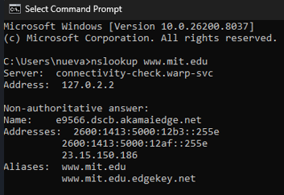
*Gambar 1: Hasil query domain menggunakan nslookup.*

**Analisis:**

* Domain berhasil diterjemahkan menjadi alamat IP
* Server DNS lokal memberikan respons
* Status biasanya berupa *Non-authoritative answer*

---

### 4.2.1 Query Record NS

1. Menjalankan perintah:

```bash
nslookup -type=NS www.mit.edu
```

2. Mengamati server DNS otoritatif

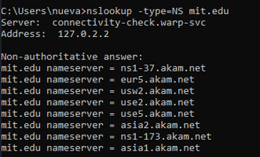
*Gambar 2: Hasil query NS record.*

**Analisis:**

* Menampilkan daftar name server otoritatif
* Server tersebut bertanggung jawab terhadap domain yang dituju

---

### 4.2.2 Query ke DNS Server Tertentu

1. Menjalankan perintah:

```bash
nslookup www.aiit.or.kr 8.8.8.8
```

2. Hasil query:

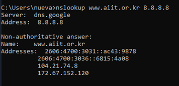
*Gambar 3: Hasil query menggunakan server DNS tertentu.*

**Analisis:**

* Perintah `nslookup www.aiit.or.kr 8.8.8.8` digunakan untuk mengirim permintaan DNS ke server tertentu, yaitu **8.8.8.8**, bukan menggunakan DNS default pada sistem.
* Alamat IP **8.8.8.8** merupakan server DNS publik milik Google.
* Dengan menggunakan server DNS tersebut, proses resolusi domain dilakukan langsung antara host pengguna dan server DNS **8.8.8.8**.
* Server DNS kemudian mengembalikan hasil berupa alamat IP dari domain **[www.aiit.or.kr](http://www.aiit.or.kr)**.
* Domain tersebut merupakan server web milik Advanced Institute of Information Technology di Korea.
* Query ini bertujuan untuk membandingkan atau memastikan hasil resolusi domain dari server DNS tertentu.

---

### 4.2.3 Query Alamat IP Server Web di Asia

1. Menjalankan perintah:

```bash
nslookup www.nus.edu.sg
```

2. Hasil query:

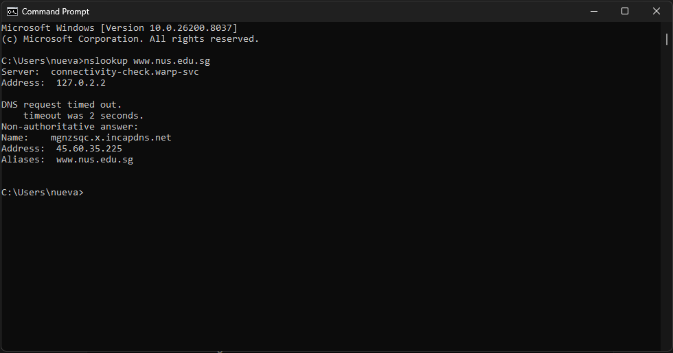
*Gambar 4: Hasil query alamat IP [www.nus.edu.sg](http://www.nus.edu.sg).*

**Analisis:**

* Perintah `nslookup www.nus.edu.sg` digunakan untuk mengetahui alamat IP dari domain tersebut.
* Domain **[www.nus.edu.sg](http://www.nus.edu.sg)** merupakan server web milik National University of Singapore (NUS) di Asia.
* Hasil query menampilkan satu atau lebih alamat IP yang terasosiasi dengan domain tersebut.
* Alamat IP inilah yang digunakan oleh client untuk mengakses server web tujuan.
* Query ini menunjukkan proses dasar resolusi DNS dari nama domain menjadi alamat IP.

---

### 4.2.4 Query DNS Otoritatif (NS Record)

1. Menjalankan perintah:

```bash
nslookup -type=NS www.ox.ac.uk
```

2. Hasil query:

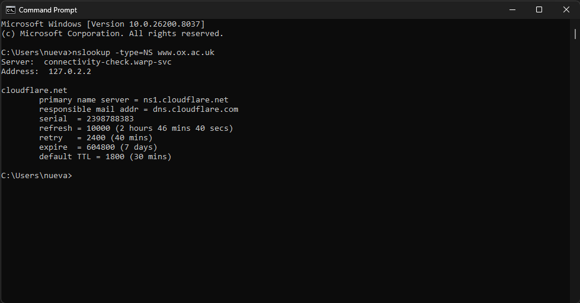
*Gambar 5: Hasil query NS record [www.ox.ac.uk](http://www.ox.ac.uk).*

**Analisis:**

* Perintah `nslookup -type=NS www.ox.ac.uk` digunakan untuk mengetahui server DNS otoritatif dari domain tersebut.
* Hasil query menampilkan daftar **Name Server (NS)** yang bertanggung jawab atas domain **[www.ox.ac.uk](http://www.ox.ac.uk)**.
* Server DNS otoritatif adalah server yang memiliki informasi resmi terkait domain tersebut.
* Informasi ini penting untuk memahami bagaimana DNS mendistribusikan tanggung jawab pengelolaan domain.
* Domain tersebut merupakan milik University of Oxford di Eropa.

---

### 4.2.5 Query Mail Server (MX Record)

1. Menjalankan perintah:

```bash
nslookup -type=MX yahoo.com 8.8.8.8
```

2. Hasil query:

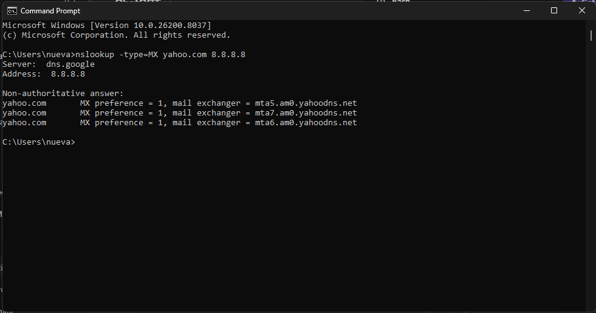
*Gambar 6: Hasil query MX record yahoo.com.*

**Analisis:**

* Perintah `nslookup -type=MX yahoo.com 8.8.8.8` digunakan untuk mengetahui server email dari domain **yahoo.com** dengan menggunakan DNS server tertentu (8.8.8.8).
* Hasil query menampilkan daftar **mail exchanger (MX)** yang digunakan oleh Yahoo! Mail.
* Setiap mail server memiliki nilai **priority** yang menunjukkan urutan prioritas dalam pengiriman email.
* Server dengan nilai prioritas lebih rendah akan diprioritaskan terlebih dahulu.
* Informasi ini digunakan dalam proses pengiriman email agar pesan dapat sampai ke server tujuan yang tepat.
* Dari hasil tersebut juga dapat diketahui alamat IP dari server email yang digunakan.

---

## 4.3 Ipconfig

Ipconfig merupakan utilitas pada sistem operasi Windows yang digunakan untuk menampilkan serta mengelola konfigurasi jaringan berbasis TCP/IP pada suatu host. Perintah ini sangat berguna dalam proses troubleshooting atau debugging jaringan. Pada sistem operasi Linux/Unix, perintah yang memiliki fungsi serupa adalah `ifconfig`.

Dengan menggunakan ipconfig, pengguna dapat mengetahui berbagai informasi jaringan seperti alamat IP, subnet mask, default gateway, serta alamat server DNS yang digunakan.

---

### 4.3.1 Menampilkan Informasi TCP/IP

Perintah yang digunakan:

```bash
ipconfig /all
```

Hasil:

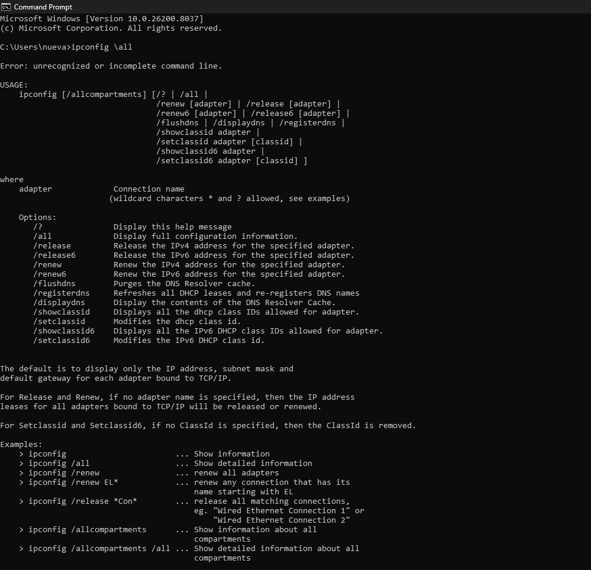
*Gambar 7: Hasil perintah ipconfig /all.*

**Analisis:**

* Perintah `ipconfig /all` digunakan untuk menampilkan seluruh konfigurasi jaringan pada host.
* Informasi yang ditampilkan meliputi alamat IP, subnet mask, default gateway, DNS server, serta jenis adaptor jaringan.
* Data ini penting untuk memastikan konfigurasi jaringan sudah benar dan sesuai.
* Perintah ini sering digunakan untuk mendeteksi masalah koneksi jaringan.

---

### 4.3.2 Menampilkan DNS Cache

Perintah yang digunakan:

```bash
ipconfig /displaydns
```

Hasil:

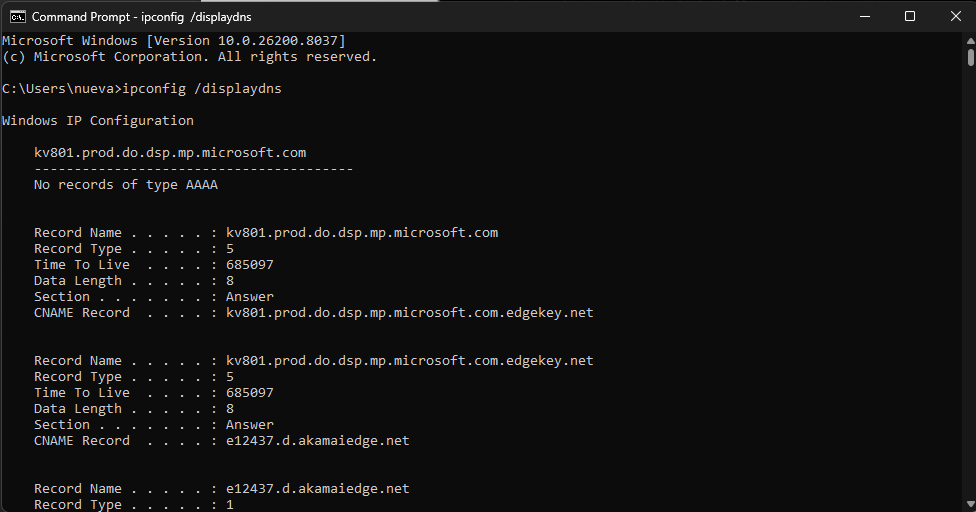
*Gambar 8: Hasil perintah ipconfig /displaydns.*

**Analisis:**

* Perintah `ipconfig /displaydns` digunakan untuk menampilkan cache DNS yang tersimpan pada host.
* Cache ini berisi record DNS yang sebelumnya telah diakses.
* Setiap record memiliki nilai **Time To Live (TTL)** dalam satuan detik.
* TTL menunjukkan berapa lama record tersebut akan disimpan sebelum diperbarui kembali.
* Informasi ini membantu mempercepat proses akses ke domain yang sering dikunjungi.

### 4.4 Tracing DNS dengan Wireshark Tanpa nslookup

Pada percobaan ini dilakukan analisis paket DNS menggunakan aplikasi Wireshark untuk memahami proses komunikasi DNS saat mengakses sebuah website.

---

#### Langkah Percobaan:

1. Menghapus cache DNS:

```bash
ipconfig /flushdns
```

2. Membuka browser dan mengakses website:

```
http://www.ietf.org
```

3. Menjalankan Wireshark dengan filter:

```
ip.addr == 192.168.100.31
```

4. Melakukan capture paket dan menghentikannya setelah halaman berhasil dimuat.

---

#### Hasil Capture:

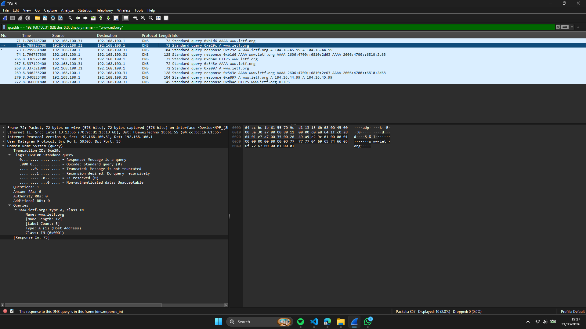
*Gambar 10: Hasil capture paket DNS pada Wireshark.*

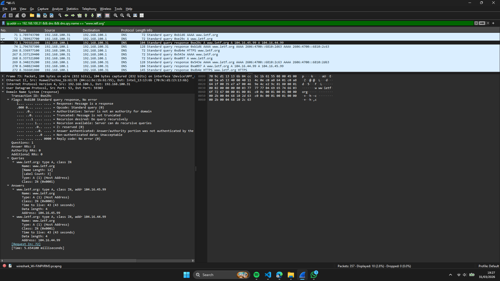
*Gambar 11: Hasil capture paket DNS Response pada Wireshark.*
---

#### Analisis:

**1. Apakah menggunakan UDP atau TCP?**

* Paket DNS query dan response dikirim menggunakan **UDP**.
* Terlihat pada detail paket terdapat informasi **User Datagram Protocol (UDP)**.

---

**2. Port tujuan dan sumber**

* Port tujuan pada DNS query adalah **53** (port standar DNS).
* Port sumber pada DNS response juga berasal dari **port 53**, sedangkan port tujuan kembali ke port client (ephemeral port).

---

**3. Alamat IP tujuan dan DNS lokal**

* Alamat IP tujuan pada DNS query adalah **192.168.100.1**.
* Berdasarkan ipconfig, alamat tersebut merupakan **DNS server lokal**.
* Jadi, alamat IP tujuan dan DNS lokal **sama**.

---

**4. Jenis (type) query DNS**

* Pada paket terlihat query dengan tipe:

  * **A (Host Address)** → untuk mendapatkan alamat IPv4
  * **AAAA** → untuk mendapatkan alamat IPv6
* Paket query **tidak mengandung jawaban (answers)** karena masih berupa permintaan.

---

**5. Isi jawaban DNS (response)**

* Pada DNS response terdapat beberapa jawaban, yaitu:

  * Alamat IPv4: **104.16.45.99** dan **104.16.44.99**
  * Alamat IPv6: **2606:4700:6810:2c63** dan **2606:4700:6810:2d63**
* Hal ini menunjukkan bahwa domain memiliki lebih dari satu IP (load balancing / redundancy).

---

**6. Kesesuaian dengan paket TCP SYN**

* Setelah DNS response diterima, host mengirim paket **TCP SYN** ke alamat IP hasil resolusi.
* Alamat IP tujuan pada TCP SYN **sesuai dengan IP yang diberikan oleh DNS**.

---

**7. Apakah perlu query DNS untuk setiap gambar?**

* Tidak selalu.
* Karena adanya **DNS cache**, host tidak perlu melakukan query ulang untuk setiap resource (seperti gambar).
* Selama nilai **TTL (Time To Live)** masih berlaku, sistem akan menggunakan cache yang sudah ada.

---

Berikut versi README yang sudah **dirapikan, dipadatkan, dan dibuat konsisten dengan format laporan praktikum sebelumnya** 👇

---

### 4.5 Analisis DNS Query dengan Wireshark menggunakan nslookup ([www.mit.edu](http://www.mit.edu))

Pada percobaan ini dilakukan analisis paket DNS untuk domain **[www.mit.edu](http://www.mit.edu)** menggunakan aplikasi Wireshark.

---

#### Hasil Capture:

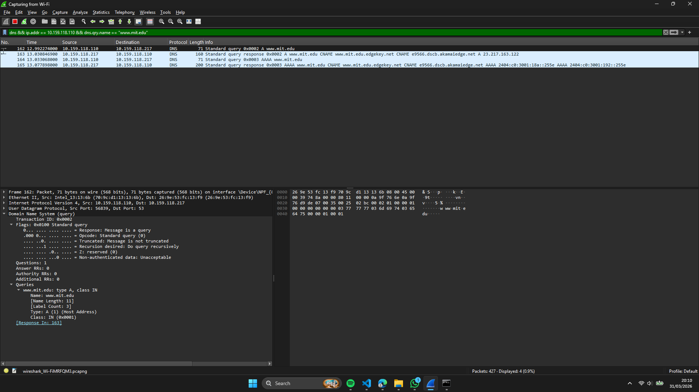
*Gambar 10: Hasil capture paket DNS pada Wireshark.*

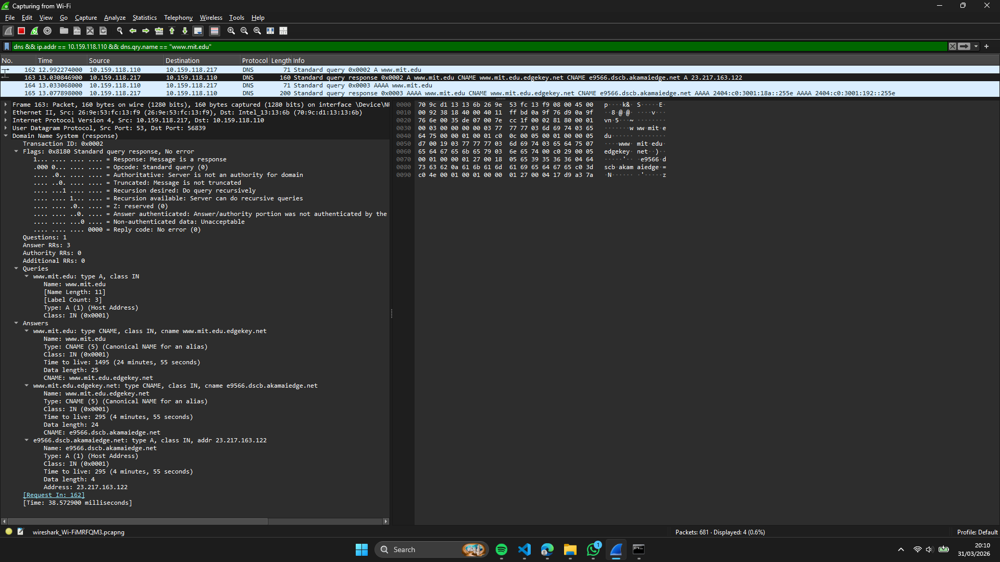
*Gambar 11: Hasil capture paket DNS Response pada Wireshark.*

**Informasi utama:**

* Client IP: 10.159.118.110
* DNS Server: 10.159.118.217
* Domain: [www.mit.edu](http://www.mit.edu)

---

#### Analisis

**1. Port tujuan dan sumber**

| Jenis Paket  | Port Sumber | Port Tujuan |
| ------------ | ----------- | ----------- |
| DNS Query    | 56839       | 53          |
| DNS Response | 53          | 56839       |

* Port **53** digunakan oleh DNS server
* Port **56839** adalah *ephemeral port* dari client

---

**2. Alamat IP tujuan DNS**

* IP tujuan DNS Query: **10.159.118.217**
* IP tersebut merupakan **DNS server lokal** (jika sesuai dengan hasil `ipconfig`)

---

**3. Jenis query dan kandungan jawaban**

* Tipe query: **A (IPv4 Address)**
* Jumlah pertanyaan: 1
* **Tidak terdapat jawaban pada query (Answer RRs = 0)**

Hal ini karena query hanya berisi permintaan, sedangkan jawaban terdapat pada response.

---

**4. Isi jawaban DNS Response**

Jumlah jawaban: **3 record**

| No | Type  | Nama Domain                                               | Hasil                                                     |
| -- | ----- | --------------------------------------------------------- | --------------------------------------------------------- |
| 1  | CNAME | [www.mit.edu](http://www.mit.edu)                         | [www.mit.edu.edgekey.net](http://www.mit.edu.edgekey.net) |
| 2  | CNAME | [www.mit.edu.edgekey.net](http://www.mit.edu.edgekey.net) | e9566.dscb.akamaiedge.net                                 |
| 3  | A     | e9566.dscb.akamaiedge.net                                 | **23.217.163.122**                                        |

**Analisis:**

* Terjadi proses **CNAME chaining** sebelum mendapatkan IP akhir
* Domain menggunakan layanan CDN dari Akamai Technologies
* IP akhir (**23.217.163.122**) merupakan server edge CDN
* TTL bervariasi (±295–1495 detik)
* Response time sekitar **38 ms**

---

### 4.6 Tracing DNS dengan Wireshark – Query ke DNS Server Spesifik

Pada percobaan ini dilakukan analisis paket DNS untuk domain **[www.aiit.or.kr](http://www.aiit.or.kr)** dengan menggunakan query ke DNS server tertentu. Analisis dilakukan menggunakan aplikasi Wireshark.

---

#### Langkah Percobaan

1. Menghapus cache DNS:

```cmd id="y1d2pf"
ipconfig /flushdns
```

2. Menjalankan Wireshark dan memulai capture.

3. Menjalankan perintah:

```cmd id="d6m2lx"
nslookup www.aiit.or.kr bitsy.mit.edu
```

4. Menggunakan filter:

```
dns && ip.addr == 10.159.118.110 && dns.qry.name == "www.aiit.or.kr"
```

5. Menghentikan capture setelah response diterima.

---

#### Hasil Capture

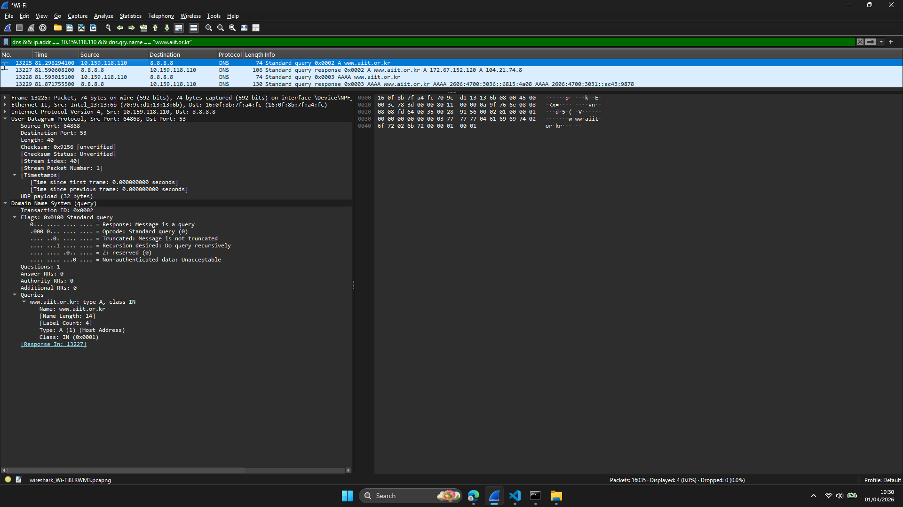
*Gambar 12: Hasil capture paket DNS pada Wireshark.*

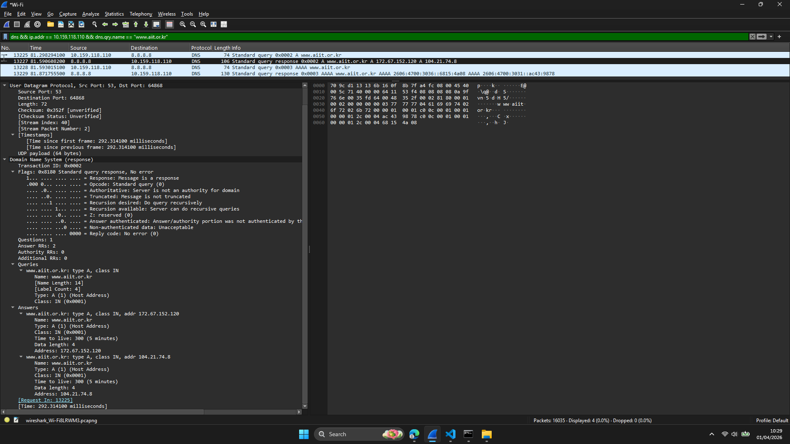
*Gambar 13: Hasil capture paket DNS Response pada Wireshark.*

**Informasi utama:**

* Client IP: 10.159.118.110
* DNS Server (terlihat pada capture): 8.8.8.8
* Domain: [www.aiit.or.kr](http://www.aiit.or.kr)

**Paket yang dianalisis:**

* Frame 13225 → DNS Query (A)
* Frame 13227 → DNS Response (A)
* Frame 13228–13229 → Query & Response AAAA

---

#### Analisis

**1. Alamat IP tujuan DNS Query**

* IP tujuan: **8.8.8.8**
* DNS lokal (berdasarkan konfigurasi): **10.159.118.217**

Query dikirim ke **Google Public DNS (8.8.8.8)**, bukan DNS lokal.

**Penjelasan:**

* Kemungkinan terjadi resolusi awal untuk server **bitsy.mit.edu**
* Atau sistem menggunakan DNS publik sebagai resolver utama

---

**2. Jenis query DNS**

* Tipe: **A (IPv4 Address)**
* Jumlah pertanyaan: 1
* **Tidak mengandung jawaban (Answer RRs = 0)**

Query hanya berisi permintaan, sedangkan jawaban terdapat pada response.

---

**3. Isi jawaban DNS Response**

Jumlah jawaban: **2 record (A)**

| No | Domain                                  | IP Address         | TTL       |
| -- | --------------------------------------- | ------------------ | --------- |
| 1  | [www.aiit.or.kr](http://www.aiit.or.kr) | **172.67.152.120** | 300 detik |
| 2  | [www.aiit.or.kr](http://www.aiit.or.kr) | **104.21.74.8**    | 300 detik |

**Analisis:**

* Domain memiliki **lebih dari satu IP** → load balancing
* IP termasuk dalam jaringan Cloudflare (CDN)
* TTL: 300 detik (5 menit) → cache relatif singkat
* Response bersifat **non-authoritative** (dari cache DNS)
* Response time ±292 ms (lebih lambat dibanding DNS lokal)

---

**4. Karakteristik tambahan**

* Menggunakan protokol **UDP port 53**
* Terdapat query tambahan tipe **AAAA (IPv6)**
* Mendukung **dual-stack network (IPv4 & IPv6)**

---

#### Perbandingan dengan Percobaan Sebelumnya

| Aspek         | DNS Lokal           | DNS Publik   |
| ------------- | ------------------- | ------------ |
| Server        | 10.159.118.217      | 8.8.8.8      |
| Response Time | Lebih cepat         | Lebih lambat |
| Sumber Data   | Lokal / cache       | Global       |
| Stabilitas    | Tergantung jaringan | Lebih stabil |

---

#### Ringkasan

| Parameter    | Nilai                       |
| ------------ | --------------------------- |
| DNS Server   | 8.8.8.8                     |
| Query Type   | A                           |
| Answer Count | 2                           |
| IP Address   | 172.67.152.120, 104.21.74.8 |
| TTL          | 300 detik                   |
| Protokol     | UDP                         |
| Teknologi    | CDN (Cloudflare)            |

---

## 5. Kesimpulan

Berdasarkan hasil praktikum Modul 4 mengenai **Domain Name System (DNS)**, diperoleh beberapa kesimpulan sebagai berikut:

1. DNS berfungsi untuk menerjemahkan nama domain menjadi alamat IP sehingga memudahkan komunikasi antar perangkat dalam jaringan.

2. Proses resolusi DNS dapat dilakukan menggunakan tool seperti **`nslookup`**, yang mampu menampilkan berbagai informasi seperti alamat IP (A record), name server (NS), dan mail server (MX).

3. DNS bekerja secara hierarkis yang melibatkan DNS lokal, root server, TLD server, hingga authoritative server dalam proses pencarian alamat domain.

4. Berdasarkan hasil analisis Wireshark, komunikasi DNS umumnya menggunakan **protokol UDP pada port 53** karena lebih cepat dan efisien.

5. Paket DNS terdiri dari dua bagian utama, yaitu **query (permintaan)** dan **response (jawaban)**, di mana query tidak mengandung jawaban, sedangkan response berisi hasil resolusi domain.

6. Satu domain dapat memiliki lebih dari satu alamat IP (multiple records) yang digunakan untuk **load balancing** dan **redundancy**, seperti yang terlihat pada domain *[www.ietf.org](http://www.ietf.org)*, *[www.mit.edu](http://www.mit.edu)*, dan *[www.aiit.or.kr](http://www.aiit.or.kr)*.

7. Beberapa domain menggunakan teknologi **Content Delivery Network (CDN)** seperti Cloudflare dan Akamai Technologies untuk meningkatkan performa dan ketersediaan layanan.

8. DNS caching dengan mekanisme **TTL (Time To Live)** memungkinkan penyimpanan sementara hasil query sehingga mengurangi beban jaringan dan mempercepat akses.

9. Penggunaan DNS server yang berbeda (lokal dan publik seperti 8.8.8.8) mempengaruhi waktu respon, di mana DNS lokal umumnya lebih cepat dibanding DNS publik.

10. Aplikasi **Wireshark** sangat membantu dalam menganalisis proses DNS secara detail, mulai dari struktur paket, jenis query, hingga isi response.

---

## 6. Daftar Pustaka

1. Kurose, J.F., & Ross, K.W. (2021). *Computer Networking: A Top-Down Approach*, 8th Edition.
2. Universitas Telkom. (2026). *Modul Praktikum Jaringan Komputer Semester Genap 2025/2026*.
3. Cloudflare. (2024). *What is DNS?* [https://www.cloudflare.com/learning/dns/what-is-dns/](https://www.cloudflare.com/learning/dns/what-is-dns/)
4. RFC 1034 & RFC 1035 - Domain Name System