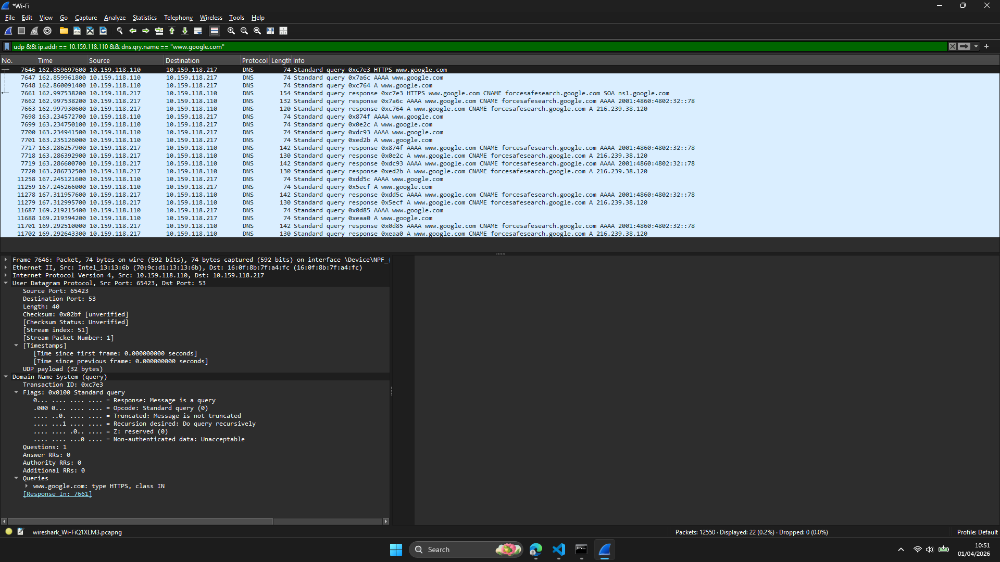
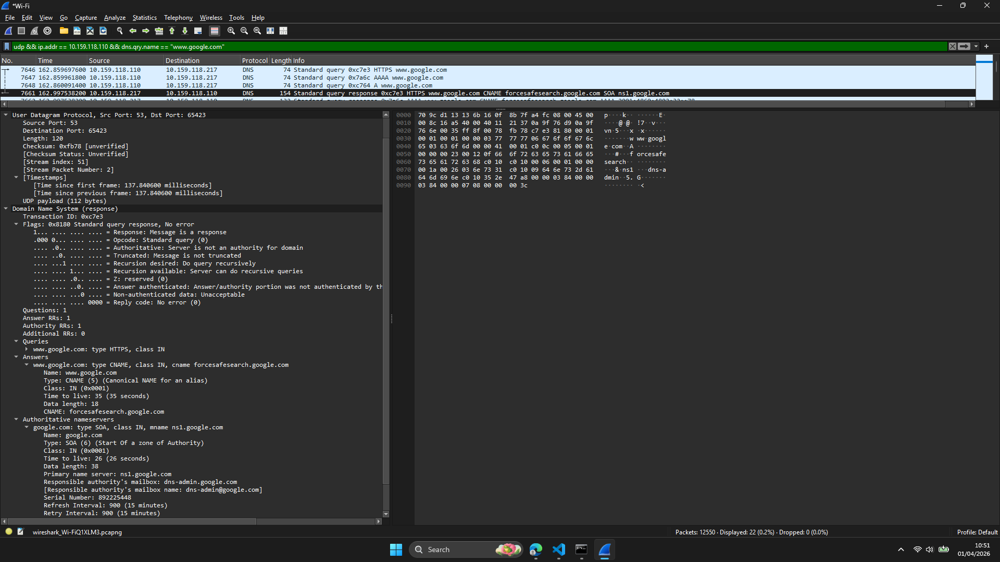

# Laporan Praktikum Jaringan Komputer - Modul 5

## User Datagram Protocol (UDP)

### Identitas Praktikan

| Item      | Keterangan                |
| --------- | ------------------------- |
| **Nama**  | Nuevalen Refitra Alswando |
| **NIM**   | 103072430008              |
| **Kelas** | IF-04-01                  |

---

## 5.1 Tujuan Praktikum

Berdasarkan modul praktikum Jaringan Komputer Semester Genap 2025/2026, tujuan dari Modul 5 adalah:

1. Mahasiswa dapat menginvestigasi cara kerja protokol UDP menggunakan Wireshark.
2. Mahasiswa mampu mengidentifikasi struktur header UDP dan field-field yang terdapat di dalamnya.
3. Mahasiswa dapat memahami fungsi dan ukuran masing-masing field pada header UDP.
4. Mahasiswa mampu menganalisis hubungan port sumber dan port tujuan pada komunikasi UDP.
5. Mahasiswa dapat menghitung kapasitas maksimum payload UDP berdasarkan spesifikasi protokol.

---

## 5.1.1 Dasar Teori

**User Datagram Protocol (UDP)** adalah protokol transport yang sederhana dan tidak berorientasi koneksi (*connectionless*). Berbeda dengan TCP yang kompleks dan memiliki mekanisme reliable delivery, UDP dirancang untuk aplikasi yang mengutamakan kecepatan dan efisiensi.

### Karakteristik UDP:

1. **Connectionless:** Tidak memerlukan proses handshake sebelum pengiriman data.
2. **Unreliable:** Tidak ada jaminan paket sampai, tidak ada acknowledgment (ACK).
3. **Lightweight:** Header hanya 8 byte dengan overhead minimal.
4. **Fast:** Cocok untuk aplikasi real-time seperti streaming video, VoIP, DNS, dan gaming.
5. **Broadcast/Multicast Support:** Mendukung pengiriman ke banyak penerima sekaligus.

### Struktur Header UDP:

Header UDP terdiri dari 4 field utama dengan total ukuran 8 byte:

```
 0                   1                   2                   3
 0 1 2 3 4 5 6 7 8 9 0 1 2 3 4 5 6 7 8 9 0 1 2 3 4 5 6 7 8 9 0 1
+-+-+-+-+-+-+-+-+-+-+-+-+-+-+-+-+-+-+-+-+-+-+-+-+-+-+-+-+-+-+-+-+
|     Source Port (16 bit)      |   Destination Port (16 bit)   |
+-+-+-+-+-+-+-+-+-+-+-+-+-+-+-+-+-+-+-+-+-+-+-+-+-+-+-+-+-+-+-+-+
|            Length (16 bit)    |         Checksum (16 bit)     |
+-+-+-+-+-+-+-+-+-+-+-+-+-+-+-+-+-+-+-+-+-+-+-+-+-+-+-+-+-+-+-+-+
|                                                               |
|                    Data/Payload (variable)                    |
|                                                               |
+-+-+-+-+-+-+-+-+-+-+-+-+-+-+-+-+-+-+-+-+-+-+-+-+-+-+-+-+-+-+-+-+
```

### Field pada Header UDP:

* **Source Port (16 bit):** Nomor port pengirim (opsional, dapat bernilai 0).
* **Destination Port (16 bit):** Nomor port tujuan.
* **Length (16 bit):** Panjang total datagram UDP (header + data).
* **Checksum (16 bit):** Digunakan untuk deteksi error pada header dan data.

### Perbandingan UDP dan TCP:

| Karakteristik | UDP | TCP |
|--------------|-----|-----|
| Connection | Connectionless | Connection-oriented |
| Reliability | Unreliable | Reliable |
| Ordering | No ordering | Ordered delivery |
| Speed | Fast | Slower |
| Overhead | Low (8 bytes) | High (20+ bytes) |
| Use Cases | DNS, VoIP, Streaming | Web, Email, File Transfer |

---

## Langkah Kerja

Berikut langkah-langkah praktikum yang dilakukan:

### 5.2 Menangkap Paket UDP dengan Wireshark

1. Membuka Wireshark dan memilih interface jaringan aktif (Wi-Fi).

2. Memulai capture paket dengan mengklik tombol **Start**.

3. Melakukan aktivitas yang menghasilkan traffic UDP:

```bash
# Flush DNS cache untuk memicu query DNS (menggunakan UDP)
ipconfig /flushdns

# Melakukan query DNS
nslookup google.com
```

4. Menghentikan capture setelah beberapa detik.

5. Menerapkan filter untuk menampilkan hanya paket UDP:

```
udp && ip.addr == 10.159.118.110 && dns.qry.name == "www.google.com"
```

6. Memilih satu paket UDP dan mengekspansi bagian **User Datagram Protocol** pada panel detail.

---

### 5.2.1 Filter Paket UDP

Untuk mempersempit hasil capture, digunakan filter yang lebih spesifik:

```
# Filter untuk DNS query www.google.com
udp && ip.addr == 10.159.118.110 && dns.qry.name == "www.google.com"
```

#### Hasil Capture


*Gambar 12: Hasil capture paket DNS pada Wireshark.*
- **Frame 7646**: DNS Query (Type HTTPS)


*Gambar 13: Hasil capture paket DNS Response pada Wireshark.*
Terdapat beberapa paket DNS yang tertangkap, dengan fokus pada:
- **Frame 7661**: DNS Response (CNAME + SOA)

**Analisis:**

* Filter memungkinkan analisis yang lebih fokus pada traffic DNS tertentu.
* Kombinasi filter menampilkan hanya paket UDP untuk query www.google.com.
* Terlihat query menggunakan tipe **HTTPS** (RFC 8484), bukan tipe A standar.

---

### 5.3 Analisis Struktur Header UDP

Pada bagian ini dilakukan analisis mendalam terhadap struktur header UDP dengan memilih paket UDP dari hasil capture.

---

#### Hasil Analisis Header UDP:

**Informasi dari Frame 7646 (DNS Query):**

```
User Datagram Protocol, Src Port: 65423, Dst Port: 53
    Source Port: 65423
    Destination Port: 53
    Length: 74
    Checksum: 0x02bf [unverified]
```

**Informasi dari Frame 7661 (DNS Response):**

```
User Datagram Protocol, Src Port: 53, Dst Port: 65423
    Source Port: 53
    Destination Port: 65423
    Length: 120
    Checksum: 0xfb78 [unverified]
```

---

#### Analisis Field Header UDP:

**1. Jumlah Field pada Header UDP**

Header UDP terdiri dari **4 (empat) field** utama:

| No | Nama Field | Ukuran | Fungsi |
|----|-----------|--------|--------|
| 1 | **Source Port** | 16 bit | Port asal pengirim |
| 2 | **Destination Port** | 16 bit | Port tujuan penerima |
| 3 | **Length** | 16 bit | Panjang total UDP (header + data) |
| 4 | **Checksum** | 16 bit | Deteksi error pada header dan data |

**Analisis:**

* Setiap field memiliki ukuran **16 bit (2 byte)**.
* Total ukuran header UDP adalah **8 byte** (64 bit).
* Header UDP jauh lebih sederhana dibanding TCP yang memiliki minimal 20 byte.

---

**2. Panjang Masing-Masing Field**

Dari hasil analisis pada Wireshark:

| Field | Panjang (bit) | Panjang (byte) |
|-------|--------------|----------------|
| Source Port | 16 bit | 2 byte |
| Destination Port | 16 bit | 2 byte |
| Length | 16 bit | 2 byte |
| Checksum | 16 bit | 2 byte |
| **Total Header** | **64 bit** | **8 byte** |

**Verifikasi dari Wireshark:**

```
User Datagram Protocol (8 bytes total)
├── Source Port: 2 bytes
├── Destination Port: 2 bytes
├── Length: 2 bytes
└── Checksum: 2 bytes
```

**Analisis:**

* Setiap field memiliki ukuran yang sama yaitu 2 byte.
* Total header UDP adalah 8 byte (fixed, tidak berubah).
* Ukuran yang kecil membuat UDP efisien untuk aplikasi yang membutuhkan kecepatan.

---

**3. Makna Field "Length"**

Field **Length** pada header UDP menyatakan **panjang total datagram UDP dalam byte**, yang mencakup:

* **8 byte** untuk header UDP
* **N byte** untuk payload/data aplikasi

**Rumus:**
```
Length = Header UDP (8 byte) + Payload (variable)
```

**Verifikasi dari Trace:**

**Query (Frame 7646):**
```
Length: 74
```

Artinya:
* Total panjang datagram UDP = 74 byte
* Header UDP = 8 byte (fixed)
* Payload = 74 - 8 = **66 byte**

**Response (Frame 7661):**
```
Length: 120
```

Artinya:
* Total panjang datagram UDP = 120 byte
* Header UDP = 8 byte (fixed)
* Payload = 120 - 8 = **112 byte**

**Analisis:**

* Field Length mencakup seluruh datagram UDP (header + data).
* Nilai Length minimum adalah 8 byte (hanya header, tanpa data).
* Nilai Length maksimum adalah 65.535 byte (ukuran maksimal field 16 bit).
* Pada capture ini, response lebih besar (120 byte) karena berisi CNAME dan SOA records.

---

### 5.3.1 Perhitungan Maksimum Payload UDP

Berdasarkan ukuran field Length yang berukuran 16 bit, dapat dihitung kapasitas maksimum payload UDP.

**Perhitungan:**

```
Ukuran field Length = 16 bit
Nilai maksimum 16 bit = 2^16 - 1 = 65.535 byte

Maksimum Payload = Maksimum Length - Ukuran Header
                 = 65.535 - 8
                 = 65.527 byte
```

**Kesimpulan:**

* **Maksimum payload UDP: 65.527 byte**

**Catatan Praktis:**

Dalam implementasi nyata, ukuran payload UDP sering dibatasi lebih kecil karena:

* MTU (Maximum Transmission Unit) Ethernet: 1500 byte
* IP header: 20 byte (IPv4) atau 40 byte (IPv6)
* Sehingga payload UDP praktis: **~1472 byte** (untuk menghindari fragmentasi IP)

**Rekomendasi:**

* Untuk aplikasi yang berjalan di atas Ethernet, sebaiknya payload UDP tidak melebihi 1472 byte.
* Jika payload lebih besar, akan terjadi fragmentasi IP yang dapat menurunkan performa.

---

### 5.3.2 Analisis Nomor Port UDP

Field **Source Port** dan **Destination Port** masing-masing berukuran **16 bit**, sehingga rentang nilai yang mungkin adalah:

```
0 hingga 2^16 - 1 = 0 hingga 65.535
```

**Kesimpulan:**

* **Nomor port terbesar yang mungkin: 65.535**

**Klasifikasi Port:**

| Range Port | Kategori | Contoh Penggunaan |
|------------|----------|------------------|
| 0–1023 | Well-Known Ports | DNS (53), HTTP (80), HTTPS (443), DHCP (67/68) |
| 1024–49151 | Registered Ports | MySQL (3306), PostgreSQL (5432), MongoDB (27017) |
| 49152–65535 | Dynamic/Private Ports | Ephemeral port untuk client |

**Analisis dari Capture:**

* Client menggunakan port **65423** (ephemeral port, range 49152-65535)
* Server menggunakan port **53** (well-known port untuk DNS)
* Port 65423 dipilih secara acak oleh sistem operasi untuk sesi ini

---

### 5.3.3 Nomor Protokol UDP pada IP Header

Untuk mengetahui nomor protokol UDP, perlu diperiksa field **Protocol** pada header **IP** yang membungkus datagram UDP.

**Dari Wireshark (Frame 7646):**

```
Internet Protocol Version 4
    ...
    Protocol: UDP (17)
    ...
```

**Kesimpulan:**

* **Nomor protokol UDP dalam desimal: 17**
* **Nomor protokol UDP dalam heksadesimal: 0x11**

**Referensi:**

* IANA Protocol Numbers: https://www.iana.org/assignments/protocol-numbers/protocol-numbers.xhtml
* UDP terdaftar sebagai protocol number **17 (0x11)**

**Perbandingan dengan Protokol Lain:**

| Protokol | Nomor (Desimal) | Nomor (Hex) |
|----------|-----------------|-------------|
| ICMP | 1 | 0x01 |
| TCP | 6 | 0x06 |
| **UDP** | **17** | **0x11** |
| IPv6 | 41 | 0x29 |

---

### 5.4 Analisis Komunikasi UDP Request-Response

Pada bagian ini dianalisis hubungan antara port pada pasangan paket UDP request dan response.

---

#### Hasil Capture Request-Response:

**Paket Request (Frame 7646):**

```
Source: 10.159.118.110:65423  → Client
Destination: 10.159.118.217:53 → DNS Server Lokal
Protocol: UDP
Transaction ID: 0xc7e3
Query Type: HTTPS (65)
Domain: www.google.com
```

**Paket Response (Frame 7661):**

```
Source: 10.159.118.217:53     → DNS Server Lokal
Destination: 10.159.118.110:65423 → Client
Protocol: UDP
Transaction ID: 0xc7e3
Response: CNAME → forcesafesearch.google.com
```

---

#### Analisis Hubungan Port:

| Aspek | Request | Response |
|-------|---------|----------|
| **Source Port** | 65423 (ephemeral) | 53 (DNS) |
| **Destination Port** | 53 (DNS) | 65423 (ephemeral) |
| **Source IP** | 10.159.118.110 | 10.159.118.217 |
| **Destination IP** | 10.159.118.217 | 10.159.118.110 |
| **Transaction ID** | 0xc7e3 | 0xc7e3 |

**Pola Hubungan:**

```
Request:  Client_IP:ephemeral_port → Server_IP:service_port
Response: Server_IP:service_port  → Client_IP:ephemeral_port
```

**Kesimpulan:**

1. Port sumber pada response (**53**) **sama dengan** port tujuan pada request (**53**).
2. Port tujuan pada response (**65423**) **sama dengan** port sumber pada request (**65423**).
3. Alamat IP juga dibalik (source ↔ destination).
4. Client menggunakan **ephemeral port 65423** untuk membedakan sesi.
5. Server menggunakan **well-known port 53** agar client tahu layanan DNS.
6. **Transaction ID sama (0xc7e3)** untuk mencocokkan request-response.

**Ilustrasi Komunikasi:**

```
        ┌─────────────────────┐
        │   Client            │
        │   10.159.118.110    │
        │   Port: 65423       │
        └──────────┬──────────┘
                   │
                   │ UDP Query (Port 65423 → 53)
                   │ Transaction ID: 0xc7e3
                   │ Query: www.google.com (type HTTPS)
                   ▼
        ┌─────────────────────┐
        │   DNS Server Lokal  │
        │   10.159.118.217    │
        │   Port: 53          │
        └──────────┬──────────┘
                   │
                   │ UDP Response (Port 53 → 65423)
                   │ Transaction ID: 0xc7e3
                   │ Answer: CNAME → forcesafesearch.google.com
                   │ SOA Record: ns1.google.com
                   ▼
        ┌─────────────────────┐
        │   Client            │
        │   10.159.118.110    │
        │   Port: 65423       │
        └─────────────────────┘
```

**Analisis:**

* Mekanisme pembalikan port memungkinkan client mengidentifikasi response yang sesuai dengan request.
* Ephemeral port **65423** dipilih secara acak oleh sistem operasi untuk setiap sesi komunikasi.
* Server tetap mendengarkan pada well-known port **53** untuk menerima request dari client manapun.
* **Transaction ID 0xc7e3** digunakan untuk matching query dan response.
* Response berisi **CNAME** ke forcesafesearch.google.com, menunjukkan Google SafeSearch aktif.

---

### 5.4.1 Analisis Query Type HTTPS

**Catatan Khusus:**

Pada capture ini, query menggunakan **type HTTPS (65)**, bukan type A (1) seperti query DNS biasa.

**Penjelasan:**

* **HTTPS Record** (RFC 8484) adalah tipe record DNS yang relatif baru
* Digunakan untuk **Service Binding** untuk HTTPS
* Memberikan informasi tentang endpoint HTTPS dan parameter koneksi
* Berbeda dengan query A record yang hanya meminta IPv4 address

**Response yang Diterima:**

```
www.google.com → CNAME: forcesafesearch.google.com
```

Ini menunjukkan bahwa Google mengaktifkan **SafeSearch** pada koneksi ini, sehingga www.google.com di-redirect ke forcesafesearch.google.com.

**Authority Record:**

```
google.com: type SOA
    Primary name server: ns1.google.com
    Responsible authority's mailbox: dns-admin.google.com
    Serial Number: 892225448
    Refresh Interval: 900 (15 minutes)
```

---

## 5.5 Ringkasan Hasil Praktikum

| Parameter | Nilai | Keterangan |
|-----------|-------|------------|
| **Jumlah Field Header UDP** | 4 | Source Port, Dest Port, Length, Checksum |
| **Ukuran Tiap Field** | 2 byte (16 bit) | Total header: 8 byte |
| **Query Length** | 74 byte | Header (8) + DNS Payload (66) |
| **Response Length** | 120 byte | Header (8) + DNS Payload (112) |
| **Makna Field Length** | Total UDP datagram (header + payload) | - |
| **Maksimum Payload UDP** | 65.527 byte | 65.535 - 8 byte header |
| **Maksimum Nomor Port** | 65.535 | 2^16 - 1 |
| **Client Port** | 65423 | Ephemeral port |
| **Server Port** | 53 | Well-known port (DNS) |
| **Protocol Number UDP** | 17 (desimal) / 0x11 (hex) | Dari IP header |
| **Transaction ID** | 0xc7e3 | Matching query-response |
| **Query Type** | HTTPS (65) | HTTPS service binding |
| **Response** | CNAME + SOA | forcesafesearch.google.com |
| **Pola Port Request-Response** | Port dibalik (source ↔ dest) | Client ephemeral ↔ Server well-known |

---

## 5. Kesimpulan

Berdasarkan hasil praktikum Modul 5 mengenai **User Datagram Protocol (UDP)**, diperoleh beberapa kesimpulan sebagai berikut:

1. Header UDP sangat sederhana dan hanya terdiri dari **4 field** dengan total ukuran **8 byte**, jauh lebih kecil dibanding header TCP yang minimal 20 byte.

2. Setiap field pada header UDP berukuran **16 bit (2 byte)**, yaitu Source Port, Destination Port, Length, dan Checksum.

3. Field **Length** pada header UDP menyatakan panjang total datagram UDP (header + payload). Pada capture ini, query memiliki length **74 byte** dan response **120 byte**.

4. Payload UDP maksimum yang dapat dikirim adalah **65.527 byte** (65.535 - 8 byte header), namun dalam praktiknya dibatasi oleh MTU jaringan (sekitar 1472 byte untuk Ethernet).

5. Rentang nomor port UDP adalah **0 hingga 65.535**, dengan port 0–1023 sebagai well-known ports, 1024–49151 sebagai registered ports, dan 49152–65535 sebagai dynamic/ephemeral ports.

6. UDP memiliki **nomor protokol 17 (0x11 dalam heksadesimal)** pada lapisan IP, yang dapat dilihat pada field Protocol di header IP.

7. Pada komunikasi UDP request-response, terjadi **pembalikan port** di mana port sumber pada response sama dengan port tujuan pada request, dan sebaliknya. Client menggunakan port ephemeral **65423** dan server menggunakan port **53**.

8. **Transaction ID (0xc7e3)** digunakan untuk mencocokkan request dengan response yang sesuai.

9. Query DNS pada capture ini menggunakan **type HTTPS (65)** sesuai RFC 8484, bukan type A standar, dan response berisi **CNAME** ke forcesafesearch.google.com yang menunjukkan Google SafeSearch aktif.

10. UDP cocok untuk aplikasi yang mengutamakan **kecepatan** dan **low overhead** seperti DNS, DHCP, SNMP, VoIP, streaming video, dan gaming online, meskipun mengorbankan aspek reliabilitas.

11. Aplikasi **Wireshark** sangat efektif untuk menganalisis struktur dan cara kerja protokol UDP secara detail, mulai dari field-field header, ukuran payload, hingga pola komunikasi request-response.

---

## 6. Daftar Pustaka

1. Kurose, J.F., & Ross, K.W. (2021). *Computer Networking: A Top-Down Approach*, 8th Edition. Pearson.

2. Universitas Telkom. (2026). *Modul Praktikum Jaringan Komputer Semester Genap 2025/2026*.

3. Postel, J. (1980). *RFC 768: User Datagram Protocol*. IETF. https://tools.ietf.org/html/rfc768

4. Hoffman, P., & McManus, P. (2021). *RFC 8484: DNS Queries over HTTPS (DoH)*. IETF.

5. IANA. (2024). *Protocol Numbers*. https://www.iana.org/assignments/protocol-numbers/protocol-numbers.xhtml

6. Wireshark Foundation. (2024). *Wireshark User's Guide*. https://www.wireshark.org/docs/wsug_html_chunked/